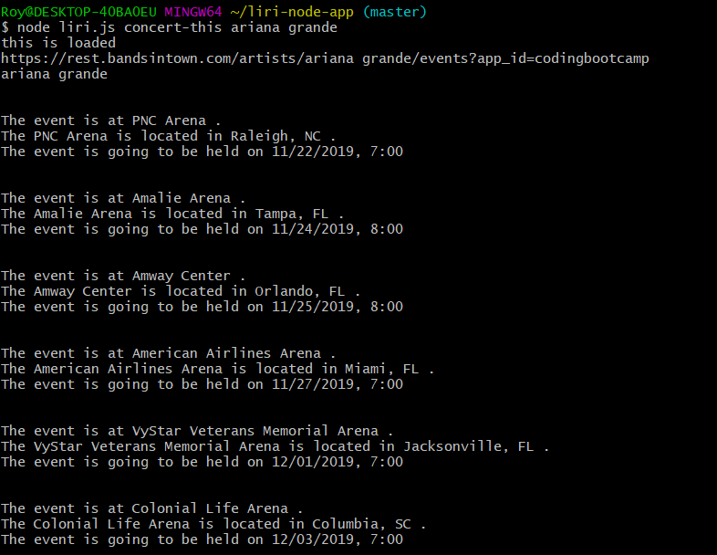
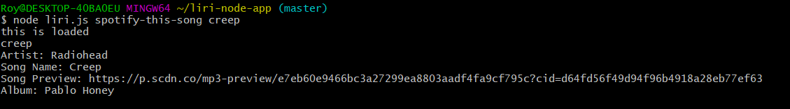
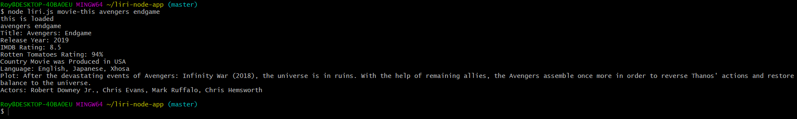
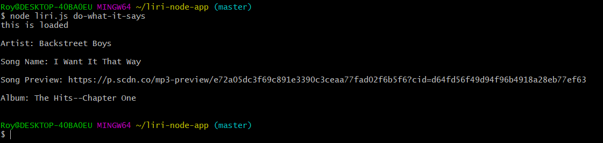

# liri-node-app

<h1>LIRI Bot</h1>
<h3>Overview</h3>

In this homework assignment we were meant to build a LIRI Bot application. LIRI is similar to SIRI, except that it is Language Interpetation and Recognition Interface where as SIRI is a Speech Interpetation and Recognition Interface. Liri is a command line node app that takes in user parameters and sends back the appropriate data.

<h3>Search commands</h3>

Before all of the following "node liri.js" must be used.

<ul>
<li>concert-this</li>
<li>spotify-this-song</li>
<li>movie-this</li>
<li>do-what-it-says</li>
</ul>

<h3>Each search command will produce different results as seen below:</h3>

*concert-this
    
        *Name of the venue

        *Venue location

        *Date of the Event (use moment to format this as "MM/DD/YYYY")

        
*spotify-this-song

        *Artist(s)

        *The song's name

        *A preview link of the song from Spotify

    *The album that the song is from

*movie-this

     *Title of the movie.
     *Year the movie came out.
     *IMDB Rating of the movie.
     *Rotten Tomatoes Rating of the movie.
     *Country where the movie was produced.
     *Language of the movie.
     *Plot of the movie.
     *Actors in the movie.

*do-what-it-says

    *It should run the spotify-this-song command for "I want it that way".

### The first search command "concert-this" uses the Bands in Town Artist Events API.

To retrieve this data we use that axios npm. When we recieve the data we console log it and use the moment npm to convert the date to MM/DD/YYYY.

#### Screenshot of this working

### The next search command is "spotify-this-song". 

This uses the node-spotify-api package to retrieve song information from the Spotify API.

#### Screenshot of this command working

### Up next is the "movie-this" command.

This command uses the axios package again but this time it retrieves data from the OMDB API

#### Screenshot of this command working

### The last command is the "do-what-it-says" command.

This command uses the fs Node package and has you retrieve the info form random.txt and use that data to search the Spotify API and get the info back for the song "I want it that way" 

#### Screenshot of this command working

